# 🤖 AI-Powered Deterministic UI Generator

**Transform natural language into production-ready React components using multi-agent AI.**

[](https://nextjs.org/)
[](https://www.typescriptlang.org/)
[](https://ryzeai.vercel.app)

🚀 **[Live Demo](https://your-vercel-url.vercel.app)** | 📹 **[Video Demo](#)** | 💻 **[GitHub Repo](https://github.com/mayurdhavale10/ryzeai)**

---

## � Architecture Diagrams

### System Architecture

*Multi-agent pipeline flow*

### Data Structure & Flow

*Component relationships and state management*

### Validation Pipeline

*Safety checks and error handling*

### Request/Response Sequence

*End-to-end request flow*

### Component Tree Structure

*UI representation as flat array*

### State Management

*Zustand store and version control*

---

## ⚡ Quick Start

```bash
# Clone and install
git clone https://github.com/mayurdhavale10/ryzeai.git
cd ryzeai
npm install

# Add your Groq API key to .env.local
echo "GROQ_API_KEY=your_key_here" > .env.local

# Run locally
npm run dev
```

Open `http://localhost:3000` and try:
```
Create a login card with email, password inputs and a submit button
```

---

## 🎯 What Makes This Special?

### 🔒 **Deterministic by Design**
Unlike ChatGPT/Claude that generate arbitrary CSS, this system uses **8 fixed, pre-built components** with unchanging styles. Every generation is predictable and consistent.

### 🧠 **Multi-Agent Architecture**
Not a single LLM call. Four specialized agents work together:
1. **Planner** - Interprets intent → JSON structure
2. **Generator** - JSON → React code (no AI needed)
3. **Explainer** - Design rationale in plain English
4. **Validator** - Safety layer enforcing whitelist

### 🔄 **Iterative, Not Regenerative**
AI **modifies** existing UI instead of starting over. Say "add a cancel button" and it preserves what you already have.

### ✅ **Production-Ready Output**
Copy-paste the generated code directly into your project. It's real React, not pseudo-code.

---

## 🧱 Component Library

8 components with **fixed, deterministic styling**:

| Component | Example Props | Use Case |
|-----------|--------------|----------|
| `Button` | `label: "Save"`, `variant: "primary"` | Actions |
| `Card` | `title: "Welcome"`, `content: "..."` | Containers |
| `Input` | `type: "email"`, `label: "Email"` | Forms |
| `Table` | `headers: "Name,Age"`, `rows: "..."` | Data |
| `Modal` | `title: "Alert"`, `variant: "warning"` | Dialogs |
| `Navbar` | `brand: "MyApp"`, `links: "..."` | Navigation |
| `Sidebar` | `items: "Home,Settings"` | Menus |
| `Chart` | `data: "10,20,30"`, `type: "bar"` | Visualization |

**Why only 8?** Constraint breeds creativity. These primitives can compose into complex UIs while maintaining determinism.

---

## 🏗️ System Architecture

```mermaid
graph LR
    A[👤 User] -->|Natural Language| B[🧠 Planner Agent]
    B -->|JSON Tree| C[⚙️ Generator]
    C -->|React Code| D[💡 Explainer]
    D --> E[✅ Validator]
    E -->|Valid?| F[🎨 Renderer]
    F -->|Live UI| A
    
    style B fill:#F05023
    style E fill:#4CAF50
```



### Data Flow Example

**Input:** `"Create a login card with email input"`

**Planner Output:**
```json
[
  {"type": "Card", "props": {"title": "Login"}},
  {"type": "Input", "props": {"type": "email", "label": "Email"}},
  {"type": "Button", "props": {"label": "Sign In"}}
]
```

**Generator Output:**
```jsx
export default function GeneratedUI() {
  return (
    <>
      <Card title="Login" />
      <Input type="email" label="Email" />
      <Button label="Sign In" />
    </>
  )
}
```

**Validator:** ✅ All components in whitelist → Render

---

## 📊 Key Technical Decisions

### Multi-Agent vs Single LLM?
**Chose Multi-Agent** because:
- Generator doesn't need AI (saves cost/latency)
- Each agent has one job (easier to debug)
- Validation happens pre-render (safer)

### Fixed Components vs AI CSS?
**Chose Fixed** because:
- Deterministic = predictable, testable
- No broken gradients or invalid Tailwind classes
- Meets assignment's core requirement

### Array vs Tree Structure?
**Chose Flat Array** because:
- Simpler validation (O(n) not O(n²))
- No recursion needed
- Prevents AI from nesting components incorrectly

---

## 🎯 Assignment Compliance

| Requirement | Implementation | Status |
|-------------|----------------|--------|
| Multi-agent system | Planner, Generator, Explainer, Validator | ✅ |
| Deterministic rendering | 8 fixed components, no AI-generated styles | ✅ |
| Iteration support | Sends current UI state to planner | ✅ |
| Safety validation | Whitelist check before render | ✅ |
| Claude-style UI | 3-panel layout (Input, Code, Preview) | ✅ |
| Git history | Meaningful commits with descriptive messages | ✅ |
| README | Architecture, decisions, limitations | ✅ |
| Live deployment | Vercel with environment variables | ✅ |
| Demo video | 5-7 min showing features | ✅ |

---

## 🧪 Try These Prompts

**Simple:**
```
Create a save button
```

**Iteration:**
```
Add a cancel button next to it
```

**Complex:**
```
Create an admin dashboard with navbar Admin Panel, sidebar with Users, Reports, Settings,
a card showing Total Revenue $45,230, and a chart displaying 1200,1800,1500,2100
```

**Reset:**
```
clear
```

---

## 🚧 Known Limitations

1. **No nested components** - Card can't contain Buttons (by design, keeps it simple)
2. **No layout control** - Uses default flex, AI can't specify grid
3. **8 components only** - Expandable, but currently constrained
4. **No streaming** - Waits for full response (could use SSE)
5. **No version rollback UI** - State exists in store, UI removed for clarity

---

## 🔮 Future Enhancements

- [ ] Add `color` prop with fixed palette (pink, blue, green)
- [ ] Implement layout agent for grid/flex control
- [ ] Stream AI responses with loading states
- [ ] Add version history UI with diff view
- [ ] Export components as downloadable files
- [ ] Support dark mode toggle

---

## 👨‍💻 Author

**Mayur Dhavale**  
📧 mayur.dhavale@email.com  
💼 [LinkedIn](https://linkedin.com/in/mayurdhavale)  
🐙 [GitHub](https://github.com/mayurdhavale10)

---

## 🙏 Acknowledgments

Built for **Ryze AI Full-Stack Assignment** with:
- [Groq](https://groq.com) - Lightning-fast LLM inference
- [Next.js](https://nextjs.org) - React framework
- [Zustand](https://zustand-demo.pmnd.rs/) - State management
- [Vercel](https://vercel.com) - Deployment platform

---

**⭐ If this helped you understand multi-agent AI systems, give it a star!**
